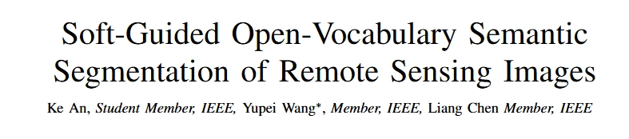
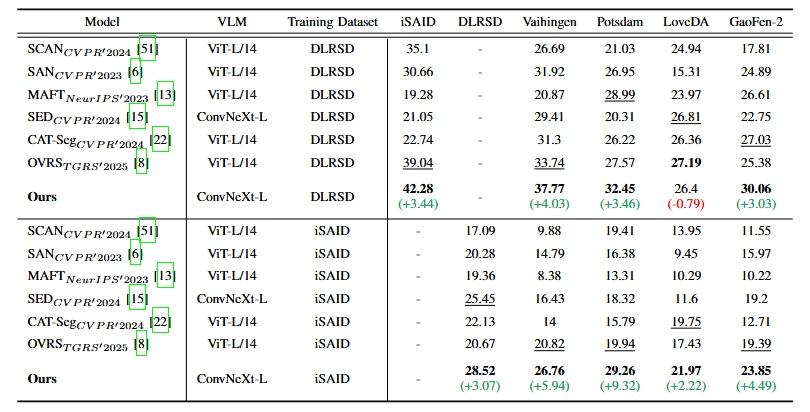

# "Soft-Guided Open-Vocabulary SemanticSegmentation of Remote Sensing Images"

## Comparison With State-of-the-art Methods

## Training script
bash sh run.sh [CONFIG] [NUM_GPUS] [OUTPUT_DIR] [OPTS]

## Evaluation script
bash sh run.sh [CONFIG] [NUM_GPUS] [OUTPUT_DIR] [OPTS]

## Acknowledgement
We would like to acknowledge the contributions of public projects, such as [CLIP](https://github.com/openai/CLIP.git),[OVRS](https://github.com/caoql98/OVRS.git),[CAT-Seg](https://github.com/cvlab-kaist/CAT-Seg.git),[SED](https://github.com/xb534/SED).
