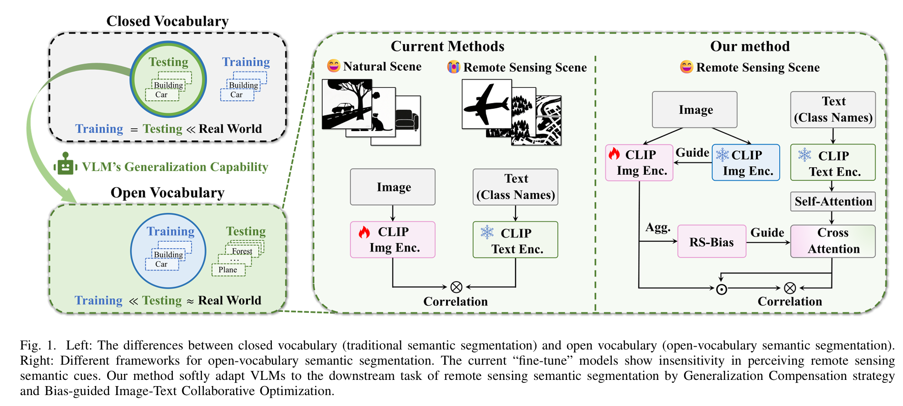
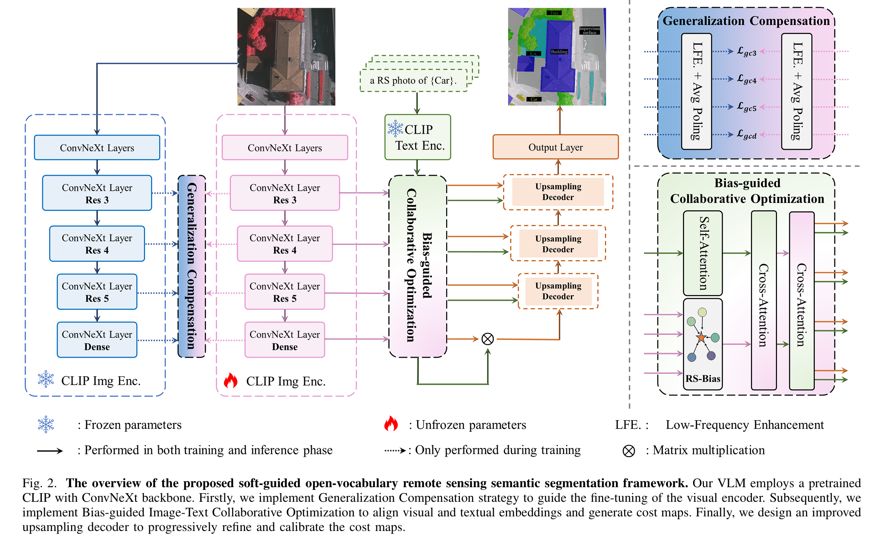

# "Soft-Guided Open-Vocabulary SemanticSegmentation of Remote Sensing Images"





## :fire:TODO
- [x] Train/Evaluation Code (April, 2025)
- [x] The Version with the VLMs of [EVA-CLIP](https://github.com/baaivision/EVA.git) (August, 2025)
- [x] Visualization Method (August, 2025)


## Comparison With State-of-the-art Methods


## Installation

- Linux or macOS with Python ≥ 3.8
- PyTorch ≥ 1.13 is recommended and [torchvision](https://github.com/pytorch/vision/) that matches the PyTorch installation.
  Install them together at [pytorch.org](https://pytorch.org) to make sure of this. Note, please check
  PyTorch version matches that is required by Detectron2.
- Detectron2: follow [Detectron2 installation instructions](https://detectron2.readthedocs.io/tutorials/install.html).
- Download the evaclip pre-trained model [here](https://pan.baidu.com/s/1h1Ljr3QRdce_PFbpu16XFg?pwd=epky)  (password:epky) and write its path in config.
- OpenCV is optional but needed by demo and visualization
- `pip install -r requirements.txt`

## Training script
```
bash sh run.sh [CONFIG] [NUM_GPUS] [OUTPUT_DIR] [OPTS]
# For example
sh run.sh configs/eva_vitl_336_rs.yaml 4 output/
```


## Evaluation script
```bash sh run.sh [CONFIG] [NUM_GPUS] [OUTPUT_DIR] [OPTS]```

## Visualization
If you want to visualize the prediction results, Please follow [Visualization](Visualization.md). 

## Acknowledgement
We would like to acknowledge the contributions of public projects, such as [CLIP](https://github.com/openai/CLIP.git),[EVA-CLIP](https://github.com/baaivision/EVA.git),[OVRS](https://github.com/caoql98/OVRS.git),[CAT-Seg](https://github.com/cvlab-kaist/CAT-Seg.git),[SED](https://github.com/xb534/SED).
